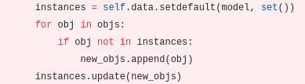

## Old Way

slow : 7 hours to cleanup 1 Million jobs

```
for j in jobs:
    j.delete()
```

## Bulk delete doesn't work well either

`Jobs.objects.filter(..).delete()`

django's `Collector` class, which does the actual deletion, will attempt to load all objects of the queryset. This uses way too much memory and is slow.

## Optimizing Collector
### 1 Don't load the objects, rather just work with querysets

Anywhere that querysets were being converted to objects, I kept them as querysets



becomes


Anywhere that assumed a list of objects, I changed to work with querysets

`parent_objs = [getattr(obj, ptr.name) for obj in new_objs]`

becomes

`parent_objs = ptr.objects.filter(pk__in = new_objs.values_list('pk', flat=True))`

### 2 Don't do pre- and post- signaling

My profiling results showed that a lot of the time was spent during `send`. We can greatly speed up the deletion by skipping these signals.


